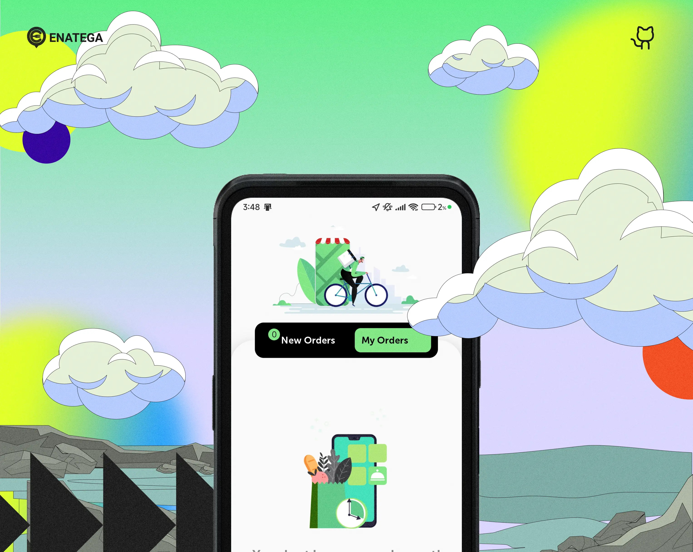
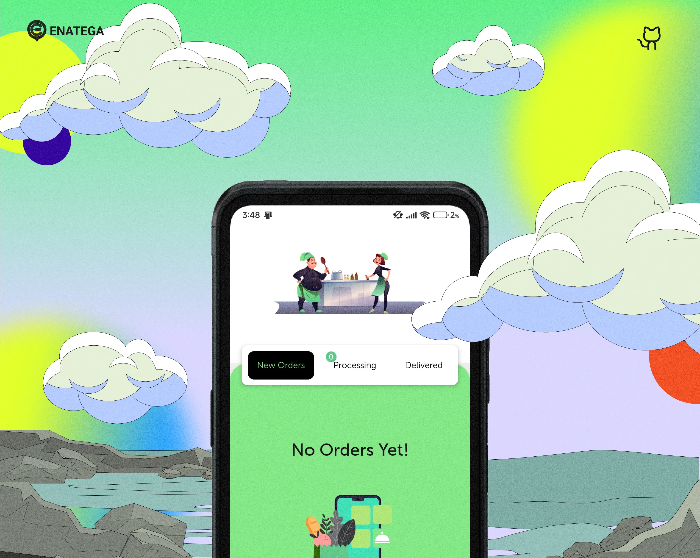
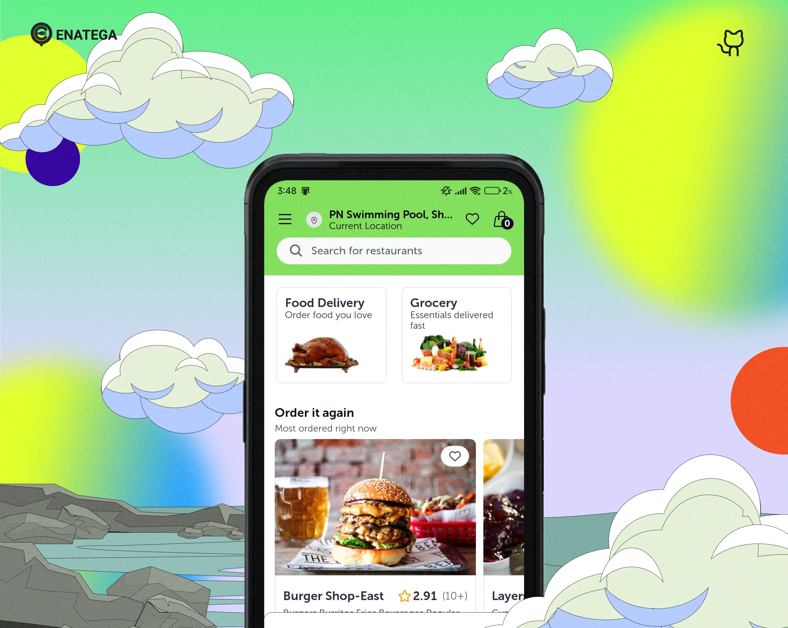
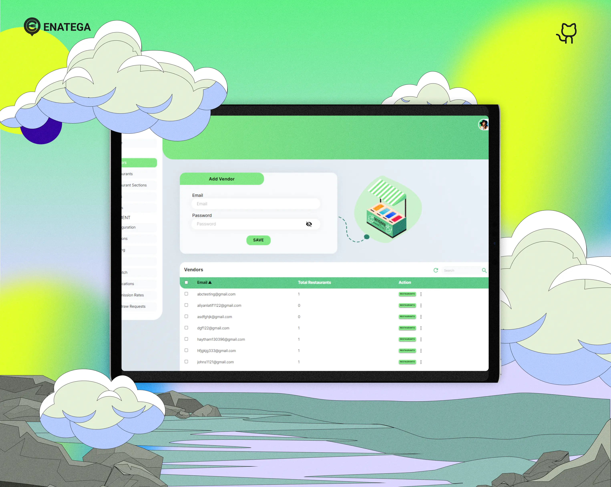
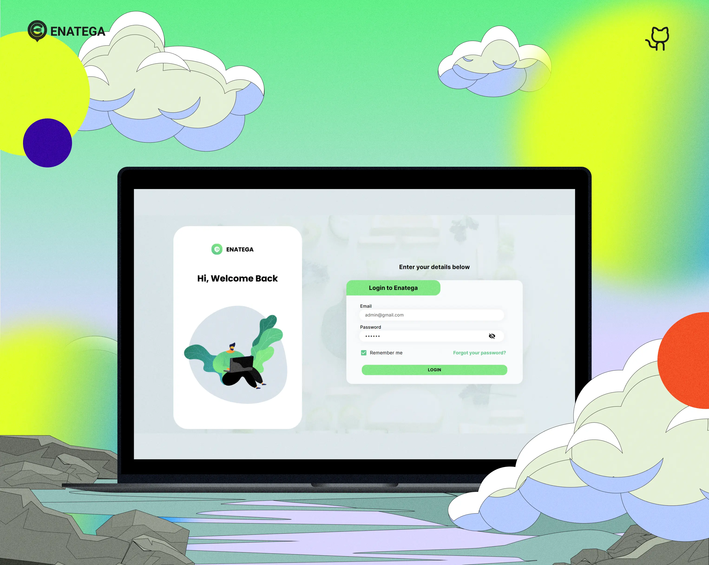
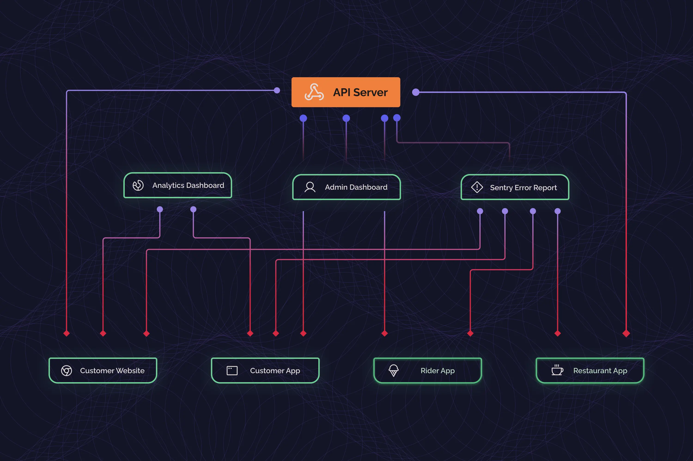

<div align="right">
<a target="_blank" href="https://www.facebook.com/sharer/sharer.php?u=https://github.com/2lokeshrao/EatsGram-New" style="text-decoration:none">
  
</a>
<a target="_blank" href="https://www.linkedin.com/shareArticle?mini=true&url=https://github.com/2lokeshrao/EatsGram-New" style="text-decoration:none">
  
</a>
<a target="_blank" href="https://twitter.com/intent/tweet?&url=https://github.com/2lokeshrao/EatsGram-New&via=TWITTER-HANDLE" style="text-decoration:none">
  
</a>

</div>

<div align="center">
  <h2>EatsGram Multi Vendor Food Delivery System</h2>
  <i>The food delivery and order management system for the future.</i>
 <br/>
<br />
</div>

<div align="center">

[](https://github.com/2lokeshrao/EatsGram-New/blob/main/LICENSE)
[](https://github.com/2lokeshrao/EatsGram-New/stargazers)
[](https://github.com/2lokeshrao/EatsGram-New/network/members)
[](https://github.com/2lokeshrao/EatsGram-New/graphs/contributors)
[](https://github.com/2lokeshrao/EatsGram-New/pulls)
[](https://github.com/2lokeshrao/EatsGram-New/commits/main)
[](https://github.com/2lokeshrao/EatsGram-New/issues?q=is%3Aissue+is%3Aclosed)
[](https://github.com/2lokeshrao/EatsGram-New/pulls?q=is%3Apr+is%3Aclosed)

</div>

<div align="center">

  <a href="https://www.youtube.com/watch?v=00voqzkFpHU">
    
  </a>

</div>

<br>

The EatsGram Multi vendor food delivery system is perfect for customers looking to deploy a readymade and easy to use food ordering platform for their own food delivery and logistics business. Just like foodpanda and ubereats, our food delivery system can incorporate multiple restaurants as well as restaurants that operate in multiple locations. With access to the admin panel and separate applications for customers and riders, you can use this solution to create your own online food ordering and order/delivery management system instantaneously.

Our solution is open source but the backend and API are proprietary, and can be obtained via paid license.

<!-- Add a horizontal rule for separation -->
<hr/>

## :fast_forward: Quick Links

- [:book: What is included](#heading-1)
- [:rocket: Features](#heading-2)
- [:wrench: Setup](#heading-3)
- [:gear: Prerequisites](#heading-4)
- [:computer: Technologies](#heading-5)
- [:camera: Screenshots](#heading-6)
- [:triangular_ruler: High Level Architecture](#heading-7)
- [:page_with_curl: Documentation](#heading-8)
- [:movie_camera: Demo Videos](#heading-14)
- [:video_game: Demos](#heading-9)
- [:busts_in_silhouette: Contributors](#heading-10)
- [:warning: Disclaimer](#heading-12)
- [:email: Contact Us](#heading-13)
- [:computer: Project Setup Guide](#heading-15)

<!-- Add a horizontal rule for separation -->
<hr/>

## :question: What is included: <a id="heading-1"></a>

Our food delivery system also comes with the following:

- EatsGram Multi vendor Customer App
- EatsGram Multi vendor Rider App
- EatsGram Multi vendor Restaurant App
- Customer Food Ordering Website
- Admin Web Dashboard
- Application ProgramInterface Server
- Analytics Dashboard with Expo Amplitude
- Error crash reporting with Sentry

## :fire: Features: <a id="heading-2"></a>

- Authentication using Google, Apple, and Facebook
- Different sections feature for promoting restaurants
- Push notifications and Emails to Users for account creation and order status changes
- Real-time tracking of Rider and chat with Rider option
- Email and Phone number verification
- Location-based restaurants shown on Map and Home Screen
- Multi-Language and different themes support
- Rating and Review features for order
- Details of restaurants include ratings and reviews, opening and closing timings, delivery timings, restaurant menu and items, restaurant location, minimum order
- Payment Integration for both PayPal and Stripe
- Previous order history and adding favorite restaurants
- Adding address with Google Places suggestions and Maps integration
- Analytics and Error reporting with Amplitude and Sentry
- Options to add different variations of food items and adding notes to restaurant
  Pick up and delivery option with different timings

## :repeat_one: Setup: <a id="heading-3"></a>

As we've mentioned above, the solution includes five separate modules. To setup these modules, follow the steps below:

To run the module, you need to have nodejs installed on your machine. Once nodejs is installed, go to the directory and enter the following commands

The required credentials and keys have been set already. You can setup your own keys and credentials

The version of nodejs should be between 18 to 20 (with 16 as minor version and 0 as patch)

## :information_source: Prerequisites: <a id="heading-4"></a>

App Ids for Mobile App in app.json

- Facebook Scheme
- Facebook App Id
- Facebook Display Name
- iOS Client Id Google
- Android Id Google
- Amplitude Api Key
- server url

Set credentials in API in file helpers/config.js and helpers/credentials.js

- Email User Name
- Password For Email
- Mongo User
- Mongo Password
- Mongo DB Name
- Reset Password Link
- Admin User name
- Admin Password
- User Id
- Name

Set credentials in Admin Dashboard in file src/index.js

- Firebase Api Key
- Auth Domain
- Database Url
- Project Id
- Storage Buck
- Messaging Sender Id
- App Id

NOTE: Email provider has been only been tested for gmail accounts

## :hammer_and_wrench: Technologies: <a id="heading-5"></a>

|                                               Expo                                                |                                                   React-Navigation                                                   |                                                Apollo GraphQL                                                |                                               ReactJS                                                |                                                NodeJS                                                 |                                                 MongoDB                                                 |                                                   Firebase                                                   |
| :-----------------------------------------------------------------------------------------------: | :------------------------------------------------------------------------------------------------------------------: | :----------------------------------------------------------------------------------------------------------: | :--------------------------------------------------------------------------------------------------: | :---------------------------------------------------------------------------------------------------: | :-----------------------------------------------------------------------------------------------------: | :----------------------------------------------------------------------------------------------------------: |
| <a href="https://expo.dev/"></a> | <a href="https://reactnavigation.org/"></a> | <a href="https://www.apollographql.com/"></a> | <a href="https://reactjs.org/"></a> | <a href="https://nodejs.org/en/"></a> | <a href="https://www.mongodb.com/"></a> | <a href="https://firebase.google.com/"></a> |

|                                                 React Native                                                 |                                                       React Router                                                       |                                                GraphQL                                                |                                                ExpressJS                                                 |                                                   React Strap                                                    |                                                Amplitude                                                |
| :----------------------------------------------------------------------------------------------------------: | :----------------------------------------------------------------------------------------------------------------------: | :---------------------------------------------------------------------------------------------------: | :------------------------------------------------------------------------------------------------------: | :--------------------------------------------------------------------------------------------------------------: | :-----------------------------------------------------------------------------------------------------: |
| <a href="https://reactnative.dev/"></a> | <a href="https://reactrouter.com/"></a> | <a href="https://graphql.org/"></a> | <a href="https://expressjs.com/"></a> | <a href="https://reactstrap.github.io/"></a> | <a href="https://amplitude.com/"></a> |

## :framed_picture: Screenshots: <a id="heading-6"></a>

|          Rider App           |
| :--------------------------: |
|  |

|               Restaurant APP               |
| :----------------------------------------: |
|  |

|          Customer App           |
| :-----------------------------: |
|  |

|           Customer Web            |
| :-------------------------------: |
|  |

|             Dashboard              |
| :--------------------------------: |
|  |

## :wrench: High Level Architecture: <a id="heading-7"></a>



## :book: Documentation <a id="heading-8"></a>

For complete documentation and setup guides, please refer to the individual module README files:

- [EatsGram Admin Dashboard](./EatsGram-admin/README.md)
- [EatsGram Customer Web](./EatsGram-web/README.md)
- [EatsGram Customer App](./EatsGram-app/Issue.md)
- [EatsGram Rider App](./EatsGram-rider/README.md)
- [EatsGram Restaurant App](./EatsGram-store/README.md)

## :tv: Demo Videos: <a id="heading-14"></a>

|                                               Admin Dashboard Demo                                               |                                                 Mobile App Demo                                                  |
| :--------------------------------------------------------------------------------------------------------------: | :--------------------------------------------------------------------------------------------------------------: |
| <a href="https://www.youtube.com/watch?v=18d_POMa8B4"></a> | <a href="https://www.youtube.com/watch?v=ZOBW4kdCsD4"></a> |

## :iphone: Demos: <a id="heading-9"></a>

|                                                                                                                                               Customer App                                                                                                                                                |                                                                                                                                                   Rider App                                                                                                                                                    |                                                                                                                                                       Restaurant App                                                                                                                                                        |
| :-------------------------------------------------------------------------------------------------------------------------------------------------------------------------------------------------------------------------------------------------------------------------------------------------------: | :------------------------------------------------------------------------------------------------------------------------------------------------------------------------------------------------------------------------------------------------------------------------------------------------------------: | :-------------------------------------------------------------------------------------------------------------------------------------------------------------------------------------------------------------------------------------------------------------------------------------------------------------------------: |
|                                                                                          <a href="#heading-9" style="pointer-events: none;"></a>                                                                                           |                                                                                          <a href="#heading-9" style="pointer-events: none;"></a>                                                                                          |                                                                                            <a href="#heading-9" style="pointer-events: none;"></a>                                                                                            |

## :people_holding_hands: Contributors: <a id="heading-10"></a>

<div align="center">
<br>
<a href="https://github.com/2lokeshrao/EatsGram-New/graphs/contributors">
  
</a>
</div>

## :warning: Disclaimer: <a id="heading-12"></a>

The frontend source code for our solution is completely open source. However, the API and backend is proprietary and can be accessed via a paid license. For further information, contact us on the channels provided below.

## :mailbox_with_mail: Contact Us: <a id="heading-13"></a>

For inquiries about the EatsGram Multi-vendor Food Delivery Solution, please reach out through the following channels:

- GitHub Issues: [Create an issue](https://github.com/2lokeshrao/EatsGram-New/issues)
- Email: lokeshrao050@gmail.com

## :computer: Project Setup Guide <a id="heading-15"></a>

This section provides detailed instructions for setting up and running each component of the EatsGram Multi-vendor Food Delivery Solution.

### EatsGram Admin Dashboard (Next.js)

The admin dashboard allows you to manage restaurants, orders, riders, and more.

```bash
# Navigate to the admin dashboard directory
cd EatsGram-admin

# Install dependencies
npm install

# Start the development server
npm run dev
```

After running these commands, open your browser and navigate to [http://localhost:3000](http://localhost:3000) to access the admin dashboard.

### EatsGram Customer Web (React.js)

The customer web application allows users to browse restaurants and place orders through a web browser.

```bash
# Navigate to the customer web directory
cd EatsGram-web

# Install dependencies
npm install

# Start the development server
npm start
```

After running these commands, the application will be available at [http://localhost:3000](http://localhost:3000) in your web browser.

### EatsGram Customer App (React Native)

The customer mobile application allows users to browse restaurants and place orders on their mobile devices.

```bash
# Navigate to the customer app directory
cd EatsGram-app

# Install dependencies
npm install

# Start the Expo development server
npx expo start -c
# OR
npm start -c
```

#### Testing on a Physical Device with Expo Go

1. Press `s` in the terminal to switch to Expo Go mode
2. Scan the QR code displayed in the terminal:
   - Android: Open the Expo Go app and scan the QR code
   - iOS: Use the device's camera app to scan the QR code

### EatsGram Rider App (React Native)

The rider app allows delivery personnel to manage and complete deliveries.

```bash
# Navigate to the rider app directory
cd EatsGram-rider

# Install dependencies
npm install

# Start the Expo development server
npx expo start -c
# OR
npm start -c
```

#### Testing on a Physical Device with Expo Go

1. Press `s` in the terminal to switch to Expo Go mode
2. Scan the QR code displayed in the terminal:
   - Android: Open the Expo Go app and scan the QR code
   - iOS: Use the device's camera app to scan the QR code

### EatsGram Restaurant App (React Native)

The restaurant app allows restaurant owners to manage orders and their menu.

```bash
# Navigate to the restaurant app directory
cd EatsGram-store

# Install dependencies
npm install

# Start the Expo development server
npx expo start -c
# OR
npm start -c
```

#### Testing on a Physical Device with Expo Go

1. Press `s` in the terminal to switch to Expo Go mode
2. Scan the QR code displayed in the terminal:
   - Android: Open the Expo Go app and scan the QR code
   - iOS: Use the device's camera app to scan the QR code

### Building Development Versions

For all mobile apps (Customer, Rider, and Restaurant), you can create development builds using EAS Build.

#### Configure EAS Build

```bash
# From the app directory (customer, rider, or restaurant)
eas build:configure
```

Select your desired platform:
- android
- ios
- all

#### Build for Android

```bash
eas build --platform android --profile development
```

This will create an APK file that you can install directly on your Android device.

#### Build for iOS

```bash
eas build --platform ios --profile development
```

For iOS simulator builds, modify the `eas.json` file to include:

```json
"development": {
  "developmentClient": true,
  "distribution": "internal",
  "channel": "development",
  "ios": {
    "simulator": true
  },
  "android": {
    "buildType": "apk"
  }
}
```

Then run:

```bash
eas build --platform ios --profile development
```

---

**Created with ❤️ by EatsGram Team**
